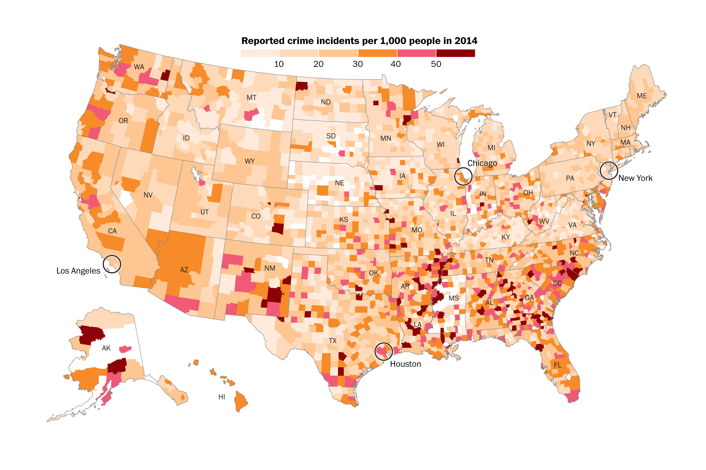
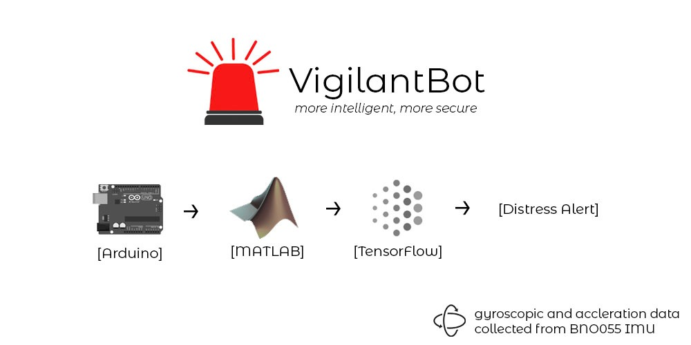

# VigilantBot 🚨 
> Violence does not discriminate by race, religion, culture, class or country. Worldwide, one in three women have experienced either physical and/or sexual violence, and more than 15 million girls aged 15-19 years have experienced rape.

**Vigilant Bot** is an **Embedded Hardware device** which can detect distress calls using complex hand gestures and help to convey the distress signals in ways such as text messages to family and automatic calls to authorities. Using Inertial Measurement Units (IMU) combined with Deep Learning algorithms served on a Matlab backend, the bot can **detect distress calls** with pinpoint accuracy and take action on the same on a real time basis.

### Problem Statement
* The process of dialling a number and calling someone in an emergency can prove to be time taking.  We need FASTER ways of doing so because in such situations, **every second is important**.  
* In situations involving criminal acts, for example kidnapping, blackmailing etc, one can be restricted from making a phone call by the offender. We need **SUBTLER** ways of informing the authorities concerned **without bringing it to the knowledge** of the offender.

### Solution
We built a pipeline based on the state-of-the-art Intertial Measurement Unit using Arduino, Matlab and Tensorflow to recognise a special gesture in the case of an emergency. If such a gesture is detected, a distress alert is automatically sent to the emergency contact of that person to take further action.   
* Our team integrated Arduino sitting on top of MATLAB computation engine to get live stream accelerometer and gyroscopic data from a BNO055  **Inertial Measurement Unit (IMU)** attached to a person's wrist and sampling at a frequency of 20 Hz. 
* A continuous data link is established between **MATLAB** and **TensorFlow** to enable live hand gesture detection using a **deep learning** model. Given the continuous inflow of data, TensorFlow makes approximately 2 predictions every second using an **input vector containing 480 data points**.
* If a critical/target gesture is detected by TensorFlow, an **e-mail is sent** on behalf of the bot to the added Emergency Contact notifying them on the distress call with the **victim's details such as name, location, etc**.

### Screenshots

### Installation
1. Download the Matlab files for supporting the backend from the [GitHub Repository](https://github.com/guptajay/NUS-Hack-Roll-2020).
2. Install `MATLAB Support Package for Arduino Hardware` from [here](https://www.mathworks.com/matlabcentral/fileexchange/47522-matlab-support-package-for-arduino-hardware).
2. Connect the Arduino to your machine and calibrate the IMU using `acccal.m` Matlab file.
2. After calibration, run the `backend.m` & open `predict.py` on your machine.
3. Wear the device on the back side of your hand and gesture three times in case of a distress.

### Moving Forward
* This prototype is the beginning of a more robust and concrete security system. A factor of disadvantage today is the **lack of datasets for gesture recognition** training for sensors such as the IMUs. Availability of such datasets can significantly boost the performance and accuracy of such system. 
* IMUs coupled with other sensors such as **x, y, z** may be integrated into a smart wearable device, notably a **band or a watch**. It is so because such sensors can help provide additonal data about a persons ... text ...
* Distress Alerts can be **seamlessly integrated into messaging, voice and other forms of notification services** and the bot can be further enhanced using **Robotic Process Automation (RPA)** to decrease error and downtime. 

### Team
1. [Mehul Damani](https://github.com/damanimehul)
2. [Jay Gupta](https://github.com/guptajay)
3. [Ritwik Kanodia](https://github.com/ritwikkanodia)

---

> Built for Hack&Roll 2020
